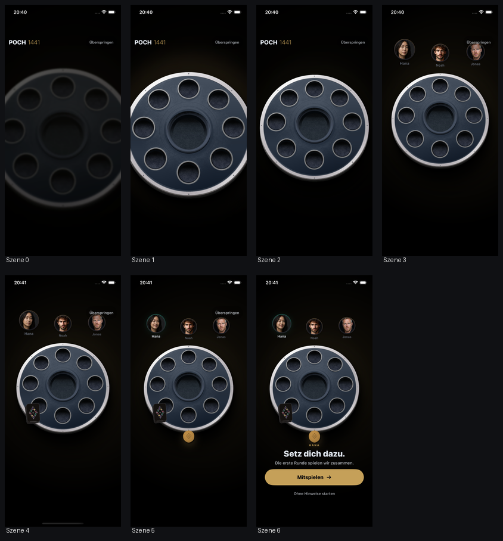
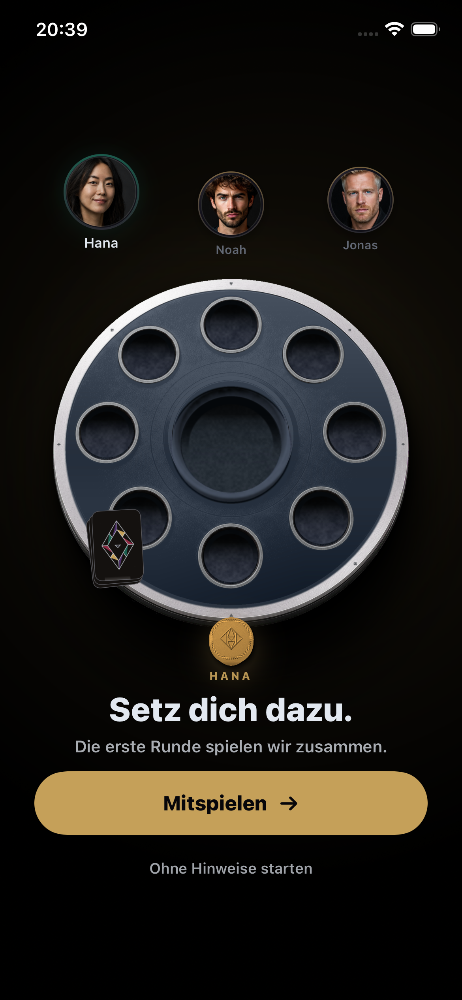
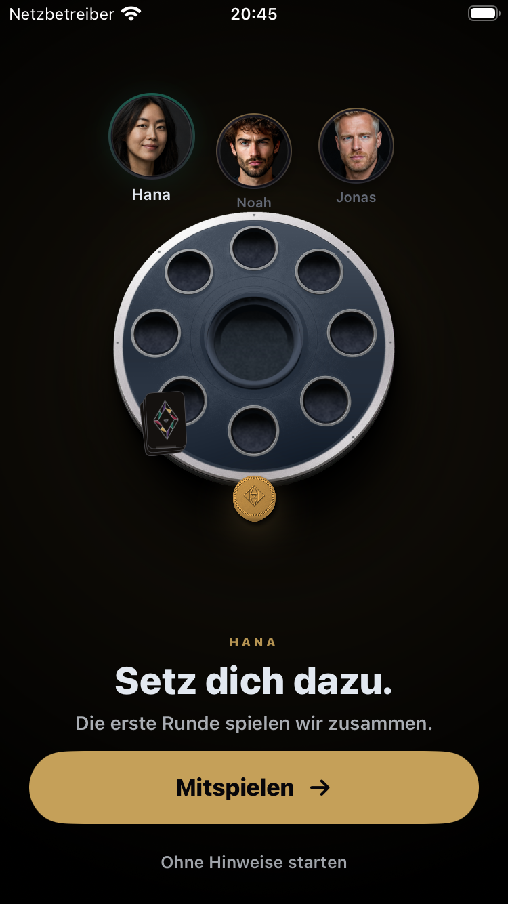
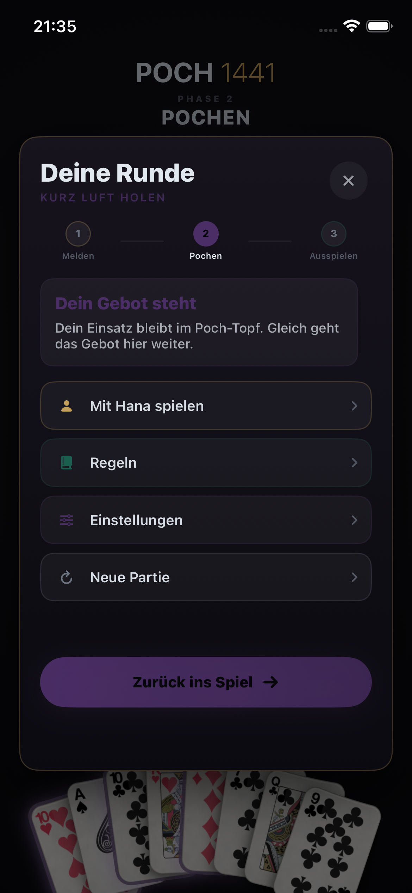
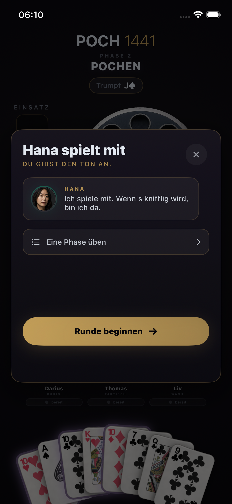
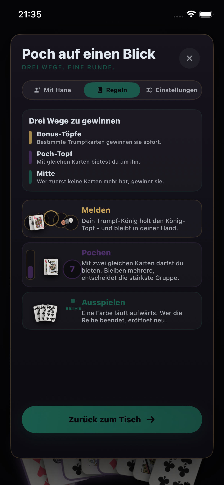
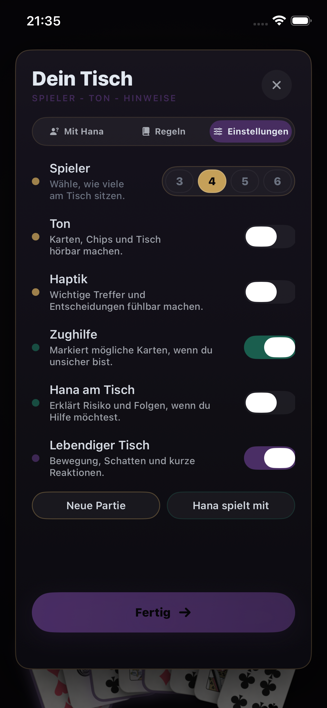

# POCH 1441 - Tutorial-Regie und sichtbare Texte

Kanonische Reviewfassung - aktueller Implementierungsstand - 23. Juli 2026

## Produktziel

Das Tutorial ist keine Regelpräsentation. Es ist eine kleine erste Partie, die drei Dinge gleichzeitig leisten muss:

1. Ein Mensch ohne Poch-Vorkenntnisse versteht vor jeder Handlung, warum sie zählt.
2. Hana, Noah und Jonas wirken wie Menschen am Tisch, nicht wie Statusanzeigen.
3. Der Schluss erzeugt freiwillig den Impuls: „Noch eine Runde.“

Wenn man danach Poch erklären kann, aber nicht weiterspielen möchte, ist das Onboarding nicht gut genug.

## Aktueller Prüfstatus

- Filmsequenz, natürliche Einladung und Übergang in die geführte Runde: automatisiert grün auf 390 × 844.
- Reduced Motion: direkte, ruhige Einladung mit derselben Bedeutung, automatisiert grün.
- Pause, Hana-Einstieg, Regeln und Einstellungen: automatisiert grün auf 390 × 844 und 375 × 667.
- Regeltexte: alle drei Gewinnwege vollständig scrollbar und ohne Ellipse verifiziert.
- Physischer iPhone-Start, menschlicher Audio-/Foley-Review, Haptik-aus, 240-fps-/96-kHz-Sync und sieben Sprachen: weiterhin offen.
- TestFlight und Produktion bleiben gesperrt, bis alle Pflichtgates grün sind.

## Filmische Eröffnung - „Der freie Platz“

Die Eröffnung läuft nur beim ersten Start. Sie zeigt keine Regelkarten und kein Lernmenü. Die Kamera befindet sich am freien vierten Platz und landet am selben Tisch, an dem direkt danach gespielt wird.

### C0 - Dunkelheit - 0,00 Sekunden

**Text:** keiner.

**Regie:** Der Tisch ist nur als schwere Silhouette erkennbar. Die Kamera steht sehr nah. Das POCH-1441-Zeichen ist ruhig im Bild. „Überspringen“ bleibt erreichbar.

### C1 - Kontakt - 0,55 Sekunden

**Text:** keiner.

**Regie:** Ein einzelner schwerer Kontakt setzt die Szene in Bewegung. Bei aktivierter Haptik antwortet genau ein kräftiger Impuls. Der Tisch komprimiert minimal, die Kamera beginnt zurückzufahren.

**Wichtig:** Es wird kein neuer Münzklang behauptet. Der menschliche Foley- und Audio-Gate bleibt rot, bis ein physischer Hörtest die Qualität bestätigt.

### C2 - Der Tisch wird sichtbar - 1,50 Sekunden

**Text:** keiner.

**Regie:** Die Kamera zieht weiter auf. Das runde Brett wird lesbar, ohne wie ein Produkt-Render zu posieren. Licht erklärt Tiefe und Mitte, nicht Luxus.

### C3 - Die Runde nimmt Platz - 2,70 Sekunden

**Text:** keiner.

**Regie:** Hana, Noah und Jonas erscheinen leicht zeitversetzt. Hana bemerkt den freien Platz zuerst. Noah liest den Tisch. Jonas bleibt zurückhaltend. Niemand schaut gleichzeitig werblich in die Kamera.

### C4 - Das Deck kommt an - 3,70 Sekunden

**Text:** keiner.

**Regie:** Das Deck gleitet mit Gewicht an den Tisch. Die Bewegung besitzt eine andere Bahn als die Porträts und endet klar, ohne Kartenregen.

### C5 - Hanas Einladung - 4,75 Sekunden

**Text:** keiner.

**Regie:** Ein einzelner goldener Chip kommt von Hanas Seite und landet vor dem freien Platz. Derselbe Chip wird nach „Mitspielen“ zur ersten echten Interaktion der Lernrunde.

### C6 - Der Platz ist bereit - ungefähr 6,20 Sekunden

**Auf dem Bildschirm:**

> HANA
>
> Setz dich dazu.
>
> Die erste Runde spielen wir zusammen.

**Aktionen:**

- Hauptaktion: „Mitspielen“
- Nebenaktion: „Ohne Hinweise starten“

### Reduced Motion und VoiceOver

Bei Reduced Motion oder VoiceOver wird die automatische Kamerafolge übersprungen. Menschen, Tisch und Einladung stehen sofort ruhig bereit.

**Zusätzlicher Erklärungstext:**

> Hana spielt die erste Runde mit dir. Bestimmte Trumpfkarten gewinnen Bonus-Töpfe, gleiche Karten öffnen das Pochen und die letzte Karte gewinnt die Mitte.

## Übergabe an die erste echte Handlung

Nach „Mitspielen“ gibt es keinen Menübruch. Der Einladungschip bleibt räumlich derselbe Chip.

> Wir füllen die Töpfe.
>
> Jeder legt einen Chip in jeden Topf. So gibt es gleich etwas zu gewinnen. Zieh deinen ersten Chip in die Mitte.

**Handlung:** Chip in die Mitte ziehen oder per VoiceOver-Aktion „Chip in die Mitte legen“ auslösen.

**Warum:** Erst die Bedeutung, dann die Geste. Der Spieler versteht, dass alle den Tisch gemeinsam mit möglichen Gewinnen füllen.

## Akt 1 - Melden

### Phasenfenster

> PHASE 1
>
> MELDEN
>
> Werte sammeln. Die Mitte bleibt für den Schluss.

**Aktion:** „Bonus-Töpfe ansehen“.

### M1 - Der Tisch setzt ein

> [Du/Hana/Noah/Jonas] setzt ein
>
> Ein Chip wandert nacheinander in jeden Topf. So siehst du genau, wo der Einsatz landet.

**Folge:** Jede Flugbahn hat einen sichtbaren Absender und Zieltopf. Die Montage läuft ohne nutzlosen Weiter-Tap. „Direkt zum Trumpf“ kann sie überspringen.

### M2 - Verdeckte Hände entstehen

> Verdeckte Hände entstehen
>
> Deine Karten siehst nur du. Bei Hana, Noah und Jonas bleiben die Werte verborgen.

**Folge:** Kartenbahnen, Drehungen und Ablagewinkel variieren leicht. Eigene Karten liegen offen, gegnerische als erkennbare Kartenrücken an ihren Sitzen.

### M3 - Die Hand ist vollständig

> Deine Hand ist vollständig
>
> Jetzt zeigt die offene Tischkarte, welche Farbe deine Bonus-Töpfe gewinnen kann.

### M4 - Trumpf aufdecken

> Welche Farbe ist Trumpf?
>
> Decke die Tischkarte auf. Sie bestimmt nur die Trumpffarbe und gehört zu keiner Hand.

**Aktion:** „Trumpf aufdecken“.

### M5 - Der König hat einen Grund

> Dein Trumpf-König trifft
>
> Der König-Topf gehört dem König in Trumpf. Du hältst ihn - melde ihn jetzt. Er bleibt in deiner Hand.

**Aktion:** „Trumpf-König melden“.

**Lernwirkung:** Melden bedeutet zeigen und sofort gewinnen, nicht abwerfen.

### M6 - König und Hochzeit

> König und Hochzeit
>
> Der König-Topf zahlt sofort. Mit der Trumpf-Dame bildet dein König außerdem die Hochzeit, traditionell Mariage genannt.

**Folge:** Nur erklärte Auszahlungen bewegen sich, immer aus dem benannten Topf zum erkennbaren Gewinner.

### M7 - Wechsel zum Pochen

> Die Meldungen sind beendet
>
> Du hast König und Hochzeit gewonnen. Andere Bonus-Töpfe bleiben liegen und wachsen. Jetzt wartet der Poch-Topf.

**Aktion:** „Weiter zum Pochen“.

## Akt 2 - Pochen

### Phasenfenster

> PHASE 2
>
> POCHEN
>
> Gleiche Karten öffnen das Gebot. Wer bleibt, zeigt.

**Aktion:** „Jetzt pochen“.

### B1 - Die eigene Stärke

> Deine Karten öffnen den Poch
>
> [Paar/Drilling/Vierling · Rang] - damit darfst du pochen. Was Hana hält, bleibt bis zum Aufdecken ihr Geheimnis.

**Aktion:** „Einsatz wählen“.

### B2 - Eine echte Entscheidung

> Wie mutig spielst du?
>
> Der Einsatz entscheidet, wer dabeibleibt - nicht, wer gewinnt. Setze vorsichtig 1 Chip oder mache mit 2 Chips Druck.

**Wahl:** „1 Chip - vorsichtig“ oder „2 Chips - mit Druck“.

### B3 - Gebot eröffnen

> Eröffne das Gebot
>
> Mit 1 Chip forderst du den Tisch heraus. Die anderen können mitgehen, erhöhen oder passen.

Bei der mutigen Wahl steht entsprechend „Mit 2 Chips ...“.

### B4 - Der Tisch antwortet

> Dein Gebot steht
>
> Jetzt müssen die anderen mitgehen, erhöhen oder passen.

Danach dynamisch:

> Die anderen entscheiden
>
> [Name] kann mitgehen, erhöhen oder passen.

### B5 - Falls nachgezahlt werden muss

> Mitgehen oder aussteigen
>
> Mitgehen kostet [n] Chip und hält dich im Gebot. Beim Passen bleibt dein bisheriger Einsatz liegen.

### B6 - Showdown

Bei eigenem Sieg:

> Du gewinnst den Showdown
>
> Einsätze halten euch im Spiel. [Gewinnergruppe] schlägt [zweite Gruppe]: Anzahl vor Rang.

Bei einem anderen Gewinner wird dessen Name eingesetzt. Wenn alle anderen passen, wird „[Name] gewinnt ohne Aufdecken“ erklärt. Wenn niemand bietet, bleibt der Poch-Topf sichtbar liegen und wächst in der nächsten Runde.

## Akt 3 - Ausspielen

### Phasenfenster

> PHASE 3
>
> AUSSPIELEN
>
> Werde zuerst deine letzte Karte los. Dafür gibt es die Mitte.

**Aktion:** „Karten ausspielen“.

### A1 - Eigene erste Reihe

> DEINE ERSTE REIHE
>
> LEGE [Karte]
>
> [Karte] eröffnet die Reihe. Danach geht dieselbe Farbe Karte für Karte aufwärts.

**Handlung:** Die empfohlene erste Karte selbst tippen.

### A2 - Jede Folgekarte bekommt einen Grund

Eigene Folgekarte:

> TIPPE DEIN [Karte]
>
> Du hältst die nächste Karte der Reihe: [Karte].

Gegnerische Folgekarte:

> WER HAT DIE NÄCHSTE KARTE?
>
> [Name] legt [Karte], weil sie direkt auf [vorige Karte] folgt und dieselbe Farbe hat.

**Aktion:** „Nächste Karte ansehen“. Automatische Karten werden einzeln freigegeben, nicht als unverständlicher Kartenstrom abgespult.

### A3 - Eine Reihe endet

Wenn die nächste Karte fehlt:

> REIHE ENDET BEI [Karte]
>
> [fehlende Karte] fehlt. [Name] hat die letzte mögliche Karte gelegt und eröffnet deshalb neu.

Wenn ein Ass schließt:

> Mit [Ass] ist die Reihe vollständig. [Name] hat sie geschlossen und eröffnet deshalb neu.

### A4 - Eigene neue Reihe

> WÄHLE DEINE NEUE STARTKARTE
>
> Du entscheidest selbst - alle [n] Karten in deiner Hand sind gültige Starts.

**Handlung:** Eine echte Wahl aus der aktuellen Hand. Keine einzige vorbestimmte Leuchtkarte.

## Finale und Revanche

### F1 - Letzte Karte

> LETZTE KARTE
>
> Du hast deine Hand geleert.
>
> Du nimmst die Mitte. Jeder Gegner zahlt dir 1 Chip pro Restkarte - solange sein Vorrat reicht.

Bei einem gegnerischen Sieg werden Name und eigene Zahlung entsprechend eingesetzt.

### F2 - Abrechnung

Die Werte heißen verbindlich „MITTE“, „RESTKARTEN“ und „GESAMT“. Quelle, Empfänger und Grund jeder Chipbewegung bleiben sichtbar.

### F3 - Zweite Runde statt Regeltest

Nach allen drei Lernteilen zeigt Hana sichtbar Revanche. Der größte nicht gewonnene Bonus-Topf bleibt auf dem Tisch.

> Nicht schlecht für die erste Runde.
>
> „Nächstes Mal ohne meine Tipps.“ Der [Topf]-Topf bleibt liegen und wächst. Hana will ihn zurück.

**Hauptaktion:** „Noch eine Runde“.

## Aktuelle Menüführung

### Pause

- Titel: „Deine Runde“
- Unterzeile: „KURZ LUFT HOLEN“
- Dynamischer Zustand, zum Beispiel „Dein Gebot steht“
- Wege: „Mit Hana spielen“, „Regeln“, „Einstellungen“, „Neue Partie“
- Hauptaktion: „Zurück ins Spiel“

### Hana

> Hana spielt mit
>
> DU GIBST DEN TON AN.
>
> Ich spiele mit. Wenn's knifflig wird, bin ich da.

**Hauptaktion:** „Runde beginnen“. Optional: „Eine Phase üben“.

### Regeln

- „Bestimmte Trumpfkarten gewinnen Bonus-Töpfe sofort.“
- „Mit gleichen Karten bietest du um den Poch-Topf.“
- „Wer zuerst keine Karten mehr hat, gewinnt die Mitte.“

Die drei ausführlichen Karten bleiben vollständig scrollbar. Die zentrale Showdown-Zeile und Ausspielen-Regel sind ohne Ellipse getestet.

### Einstellungen

- „Zughilfe - Markiert mögliche Karten, wenn du unsicher bist.“
- „Hana am Tisch - Erklärt Risiko und Folgen, wenn du Hilfe möchtest.“
- „Lebendiger Tisch - Bewegung, Schatten und kurze Reaktionen.“
- Keine Debug-Zeile im sichtbaren Screen.

## Was noch nicht freigegeben ist

Diese Punkte bleiben bewusst rot oder pending:

1. Physischer Start-Retest auf dem TestFlight-iPhone.
2. Menschlicher Audio-/Foley-Review. Die bisher kritisierten Münztöne gelten nicht als akzeptiert.
3. Haptik und Einstellungen-aus auf echter Hardware.
4. 240-fps-/96-kHz-Synchronität und messbarer Offset.
5. Human Review aller sieben Sprachen.
6. Alle historischen roten Produktgates aus dem Projektstatus.

Es wird deshalb noch kein neuer TestFlight-Build und keine Produktionsintegration ausgelöst.

## Fragen für den externen Review

1. Macht die wortlose erste Minute neugierig oder bleibt sie nur hübsch?
2. Ist vor jeder Handlung klar, warum sie spielerisch zählt?
3. Wirken Hana, Noah und Jonas wie Menschen mit Haltung?
4. Bleiben Bonus-Töpfe, Poch-Topf und Mitte mental sauber getrennt?
5. Fühlt sich die Einsatzwahl nach einer eigenen Entscheidung an?
6. Ist das Ausspielen Karte für Karte nachvollziehbar, ohne zäh zu werden?
7. Würdest du nach dem Schluss freiwillig „Noch eine Runde“ tippen?

## Nicht mehr reviewen

Die alte Build-10-Liste und diese Begriffe sind nicht mehr kanonisch: „Der Tisch erinnert sich“, „Extra-Topf“, „Paar-Topf“, „Jetzt zählt Tempo“, „Mulde bleibt“, „Kette läuft“, „Kartenstrom“ und „Markierte Karte spielen“.
